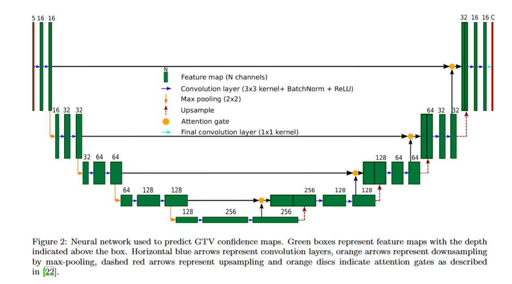
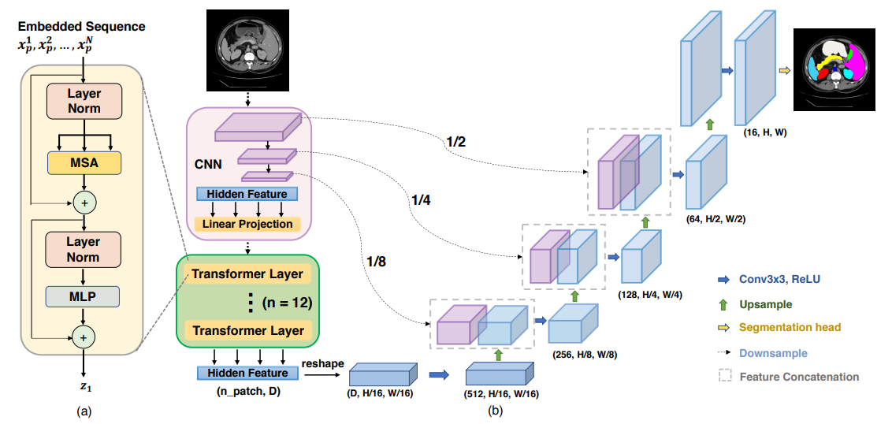
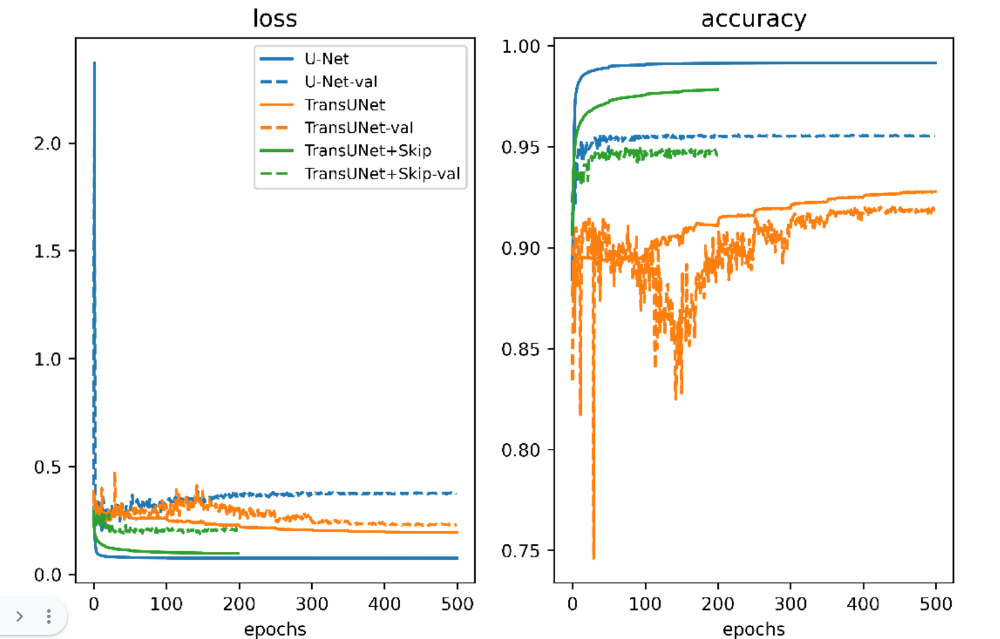
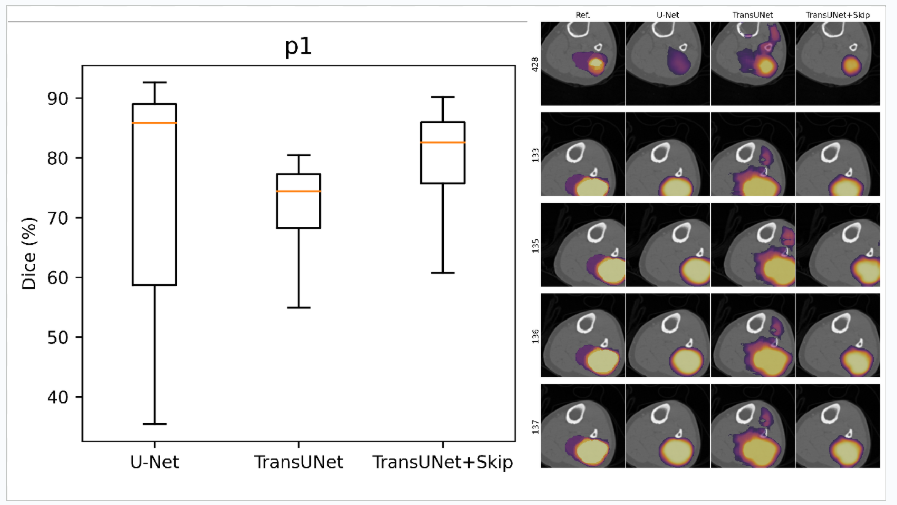
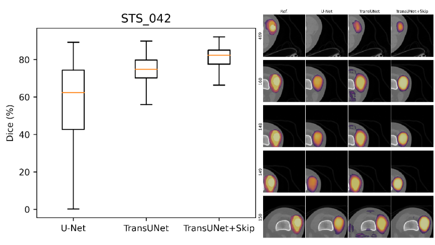
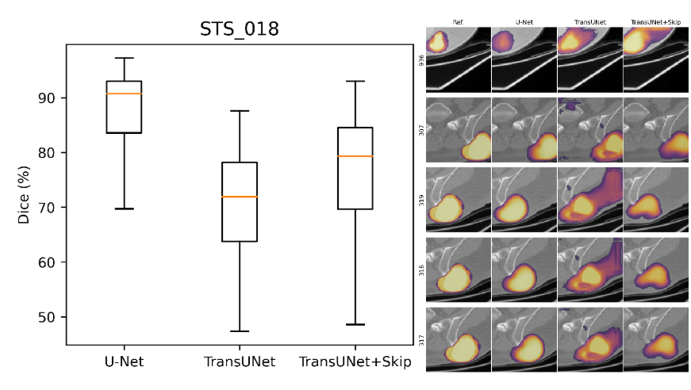

# 
MGH-AI-Research
Brief samples of my work from my summer research fellowship at MGH. 

This project was a continuation and extension of this paper https://www.researchgate.net/publication/355223156_Deep_learning-based_GTV_contouring_modeling_inter-_and_intra-_observer_variability_in_sarcomas, originally published by the El-Fakhri lab prior to my arrival in May 2023. My role was to design new network architectures to improve performance of this model in delineation of gross tumor volume (GTV) in soft tissue sarcoma.

The initial design of the model was a simple U-Net to determine relevant features in the latent space. 

My role during this project was to implement a transformer based model to more effectively account for long-distance dependencies within the system. My design followed the structure below.

The decision was made to use a hybrid, rather than transformer-only architecture for two reasons. One, for computational efficiency, since transformer block computational complexity scales at O(n^2). Additionally, we wanted the model to pay attention to both near and far dependencies, with higher attention given to near dependencies. Therefore, classical convolutional layers were kept during initial downsampling to effectively capture near-field dependencies.

The model showed improved DICE score based sensitivity, decreased specificity and comparable but slightly decreased accuracy on the test data when compared to traditional U-net architectures when skip connections were kept.

Example delineations are provided below

